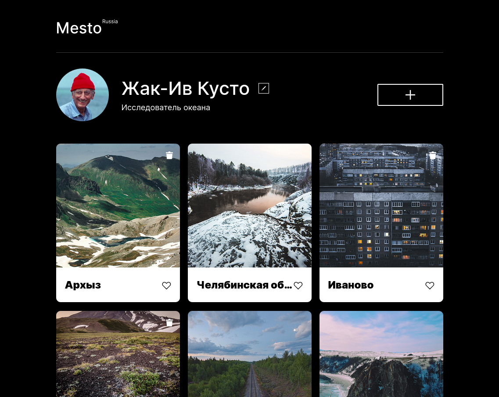
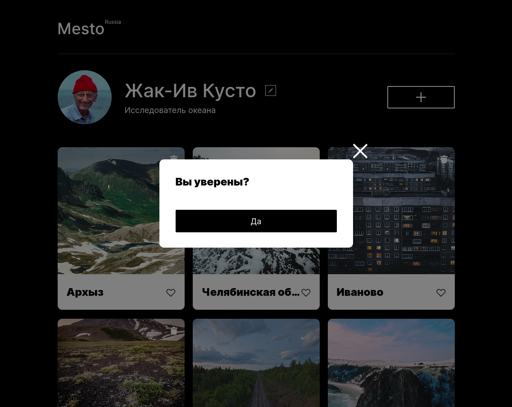
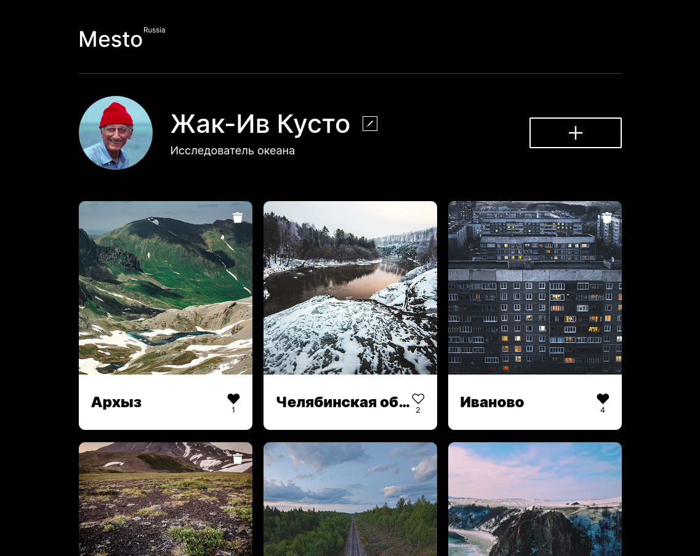
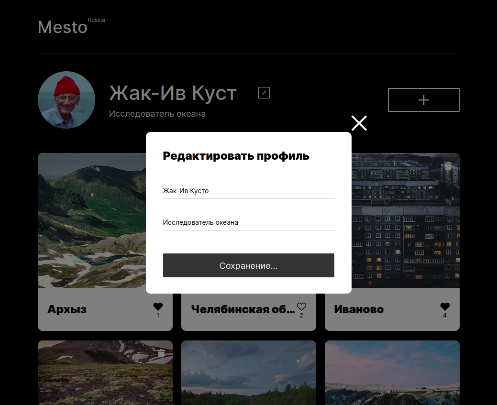
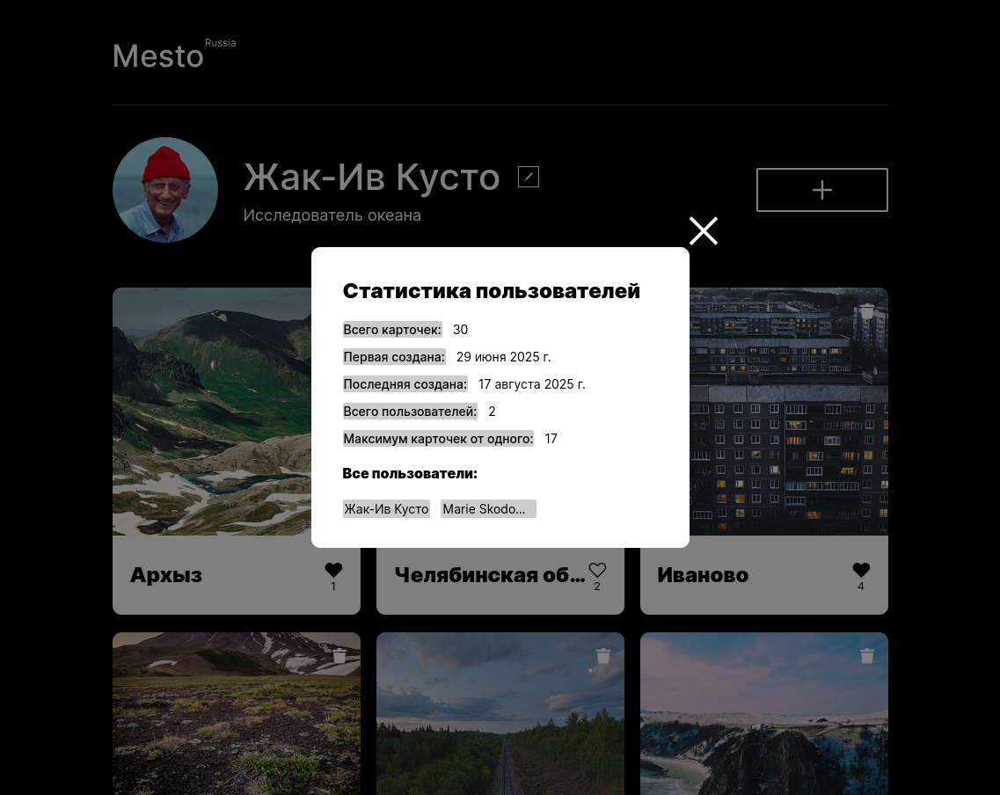
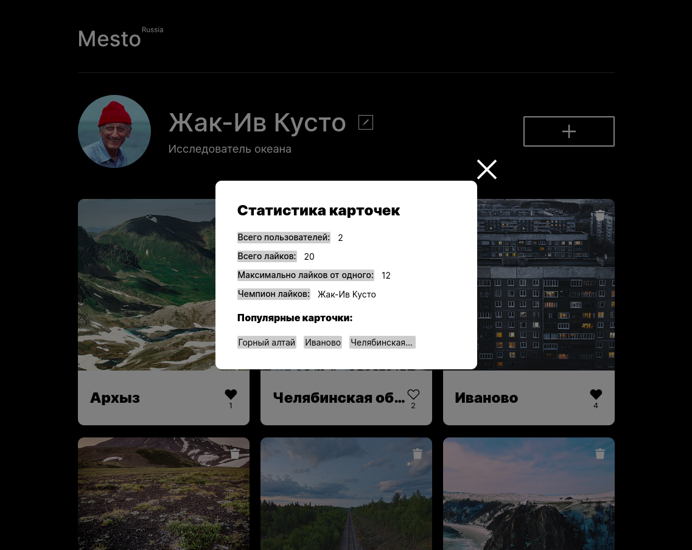
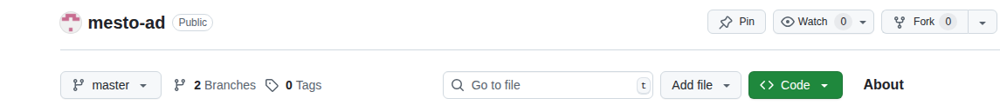
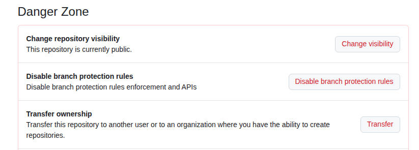
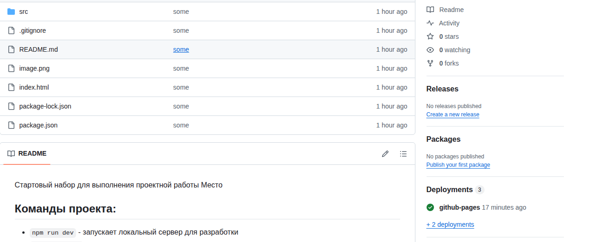

<div id="mount">

<div class="app">

<div>

</div>

<div class="page proficiency-page">

<div class="Toastify">

</div>

<div class="page__content">

<div class="unified-sidebar__container">

<!-- end list -->

 


<div class="section theory-viewer big-theory lesson__theory">

<div class="section theory-viewer__blocking-layout-block theory-viewer__block theory-viewer__block_type_vertical-layout theory-viewer__block_layout">

<div id="3d2a06ea-7ce4-431e-a3e9-fa5175caca7b" class="section theory-viewer__block theory-viewer__block_type_markdown">

<div class="Markdown base-markdown base-markdown_with-gallery markdown markdown_size_normal markdown_type_theory full-markdown">

# Проектная работа Mesto. Работа с сервером

</div>

</div>

<div id="1bba0a2c-ca76-4de3-b048-9852c7bdef54" class="section theory-viewer__block theory-viewer__block_type_markdown">

<div class="Markdown base-markdown base-markdown_with-gallery markdown markdown_size_normal markdown_type_theory full-markdown">

<div class="paragraph">

Мы подошли к финальной проектной работе всего курса. Волноваться не стоит — вы уже обладаете всеми навыками, чтобы её реализовать.

</div>

<div class="paragraph">

В ходе этой проектной работы вы:

</div>

  - подключите приложение Mesto к API,
  - улучшите UX форм,
  - добавите в приложение новую функциональность в зависимости от своего варианта задания,
  - опубликуете получившийся проект на GitHub Pages.

<div class="paragraph">

Создавать новый репозиторий не нужно — используйте существующий проект **Mesto**, создайте в нём новую ветку и продолжайте работу в ней. Если в процессе у вас сломается вёрстка, ориентируйтесь [на макет](Mesto.fig).

</div>

<div class="paragraph">

Этот проект будут проверять ревьюера от Практикума. Они прокомментируют работу: подсветят, что сделано хорошо, и подскажут, как улучшить проект.

</div>

## Личный токен и идентификатор группы

<div class="paragraph">

В первую очередь вам предстоит подключить проект Mesto к API.

</div>

<div class="paragraph">

Для этого вам понадобится личный токен и идентификатор вашей группы. Они нужны для того, чтобы сервер мог различать пользователей.

</div>

> 
> 
> <div class="paragraph">
> 
> Токен принадлежит только вам, не делитесь им с другими студентами.
> 
> </div>

<div class="paragraph">

Чтобы получить личный токен и идентификатор группы, заполните [форму «Токен для проектной работы»](https://forms.yandex.ru/surveys/13686314.378315ce5a8c2a283de90c62581aa4b4ca4c48a4/), указав адрес электронной почты, — данные будут отправлены на выбранную почту в течение пяти минут.

</div>

## Как делать запрос к API-серверу

<div class="paragraph">

В проектной работе вы будете делать множество запросов к API-серверу `https://mesto.nomoreparties.co`.

</div>

<div class="paragraph">

Для удобства и организации кода создайте файл `scr/scripts/components/api.js`, который будет содержать код запросов.

</div>

<div class="paragraph">

При каждом запросе к API нужно передавать личный токен в заголовке `authorization` и тип данных запроса. Если не передать токен, указать его неверно или обратиться к чужой группе — сервер ответит ошибкой.

</div>

<div class="paragraph">

Чтобы избежать повторения кода и данных, вынесите адрес API-сервера и повторяющиеся заголовки запроса в отдельную переменную `config`:

</div>

<div class="javascript code-block code-block_theme_light">

<div class="code-block__tools">


JAVASCRIPT

</div>

<div class="scrollable-default scrollable scrollable_theme_light code-block__scrollable">

<div>

</div>

<div class="scrollable__content-wrapper">

<div class="scrollbar-remover scrollable__content-container" tabindex="0" style="--scroll-bar-width: 16px; --scroll-bar-height: 16px;">

<div class="scrollable__content">

``` code-block__code-wrapper
const config = {
  baseUrl: "https://mesto.nomoreparties.co/v1/{{ Ваш идентификатор группы }}",
  headers: {
    authorization: "{{ Ваш личный токен }}",
    "Content-Type": "application/json",
  },
}; 
```

<div>

</div>

</div>

</div>

</div>

<div class="section scrollbar-default scrollbar scrollbar_vertical scrollbar_hidden scrollable__scrollbar scrollable__scrollbar_type_vertical" size="1" style="--scrollbar-offset-size: 177px; --scrollbar-control-size: 177px; --scrollbar-control-container-size: 100%; --scrollbar-scale: 1; --scrollbar-control-offset: 0;">

<div class="scrollbar__control-container">

<div class="scrollbar__control">

<div class="scrollbar__control-line">

</div>

</div>

</div>

</div>

<div class="section scrollbar-default scrollbar scrollbar_horizontal scrollbar_hidden scrollable__scrollbar scrollable__scrollbar_type_horizontal" size="1" style="--scrollbar-offset-size: 688px; --scrollbar-control-size: 688px; --scrollbar-control-container-size: 100%; --scrollbar-scale: 1; --scrollbar-control-offset: 0;">

<div class="scrollbar__control-container">

<div class="scrollbar__control">

<div class="scrollbar__control-line">

</div>

</div>

</div>

</div>

</div>

</div>

<div class="paragraph">

В конце каждого запроса нужно проверять, всё ли в порядке с ответом. Для этого создайте функциональное выражение и сохраните его в переменную `getResponseData`:

</div>

<div class="javascript code-block code-block_theme_light">

<div class="code-block__tools">


JAVASCRIPT

</div>

<div class="scrollable-default scrollable scrollable_theme_light code-block__scrollable">

<div>

</div>

<div class="scrollable__content-wrapper">

<div class="scrollbar-remover scrollable__content-container" tabindex="0" style="--scroll-bar-width: 16px; --scroll-bar-height: 16px;">

<div class="scrollable__content">

``` code-block__code-wrapper
const config = {
  baseUrl: "https://mesto.nomoreparties.co/v1/{{ Ваш идентификатор группы }}",
  headers: {
    authorization: "{{ Ваш личный токен }}",
    "Content-Type": "application/json",
  },
};

/* Проверяем, успешно ли выполнен запрос, и отклоняем промис в случае ошибки. */
const getResponseData = (res) => {
  return res.ok ? res.json() : Promise.reject(`Ошибка: ${res.status}`);
}; 
```

<div>

</div>

</div>

</div>

</div>

<div class="section scrollbar-default scrollbar scrollbar_vertical scrollbar_hidden scrollable__scrollbar scrollable__scrollbar_type_vertical" size="1" style="--scrollbar-offset-size: 297px; --scrollbar-control-size: 297px; --scrollbar-control-container-size: 100%; --scrollbar-scale: 1; --scrollbar-control-offset: 0;">

<div class="scrollbar__control-container">

<div class="scrollbar__control">

<div class="scrollbar__control-line">

</div>

</div>

</div>

</div>

<div class="section scrollbar-default scrollbar scrollbar_horizontal scrollbar_hidden scrollable__scrollbar scrollable__scrollbar_type_horizontal" size="1" style="--scrollbar-offset-size: 688px; --scrollbar-control-size: 688px; --scrollbar-control-container-size: 100%; --scrollbar-scale: 1; --scrollbar-control-offset: 0;">

<div class="scrollbar__control-container">

<div class="scrollbar__control">

<div class="scrollbar__control-line">

</div>

</div>

</div>

</div>

</div>

</div>

<div class="paragraph">

Теперь эту переменную можно будет использовать в методе `then` после каждого запроса для проверки его статуса.

</div>

## Получение данных пользователя с сервера

<div class="paragraph">

Для получения данных вашего пользователя напишите в файле `api.js` запрос к API-серверу по адресу `${config.baseUrl}/users/me`:

</div>

<div class="javascript code-block code-block_theme_light">

<div class="code-block__tools">


JAVASCRIPT

</div>

<div class="scrollable-default scrollable scrollable_theme_light code-block__scrollable">

<div>

</div>

<div class="scrollable__content-wrapper">

<div class="scrollbar-remover scrollable__content-container" tabindex="0" style="--scroll-bar-width: 16px; --scroll-bar-height: 16px;">

<div class="scrollable__content">

``` code-block__code-wrapper
export const getUserInfo = () => {
  return fetch(`${config.baseUrl}/users/me`, { // Запрос к API-серверу
    headers: config.headers, // Подставляем заголовки
  }).then(getResponseData);  // Проверяем успешность выполнения запроса
}; 
```

<div>

</div>

</div>

</div>

</div>

<div class="section scrollbar-default scrollbar scrollbar_vertical scrollbar_hidden scrollable__scrollbar scrollable__scrollbar_type_vertical" size="1" style="--scrollbar-offset-size: 129px; --scrollbar-control-size: 129px; --scrollbar-control-container-size: 100%; --scrollbar-scale: 1; --scrollbar-control-offset: 0;">

<div class="scrollbar__control-container">

<div class="scrollbar__control">

<div class="scrollbar__control-line">

</div>

</div>

</div>

</div>

<div class="section scrollbar-default scrollbar scrollbar_horizontal scrollbar_hidden scrollable__scrollbar scrollable__scrollbar_type_horizontal" size="1" style="--scrollbar-offset-size: 688px; --scrollbar-control-size: 688px; --scrollbar-control-container-size: 100%; --scrollbar-scale: 1; --scrollbar-control-offset: 0;">

<div class="scrollbar__control-container">

<div class="scrollbar__control">

<div class="scrollbar__control-line">

</div>

</div>

</div>

</div>

</div>

</div>

<div class="paragraph">

При выполнении такого запроса, если он прошёл успешно, в ответе от сервера вы получите объект данных пользователя:

</div>

<div class="javascript code-block code-block_theme_light">

<div class="code-block__tools">


JAVASCRIPT

</div>

<div class="scrollable-default scrollable scrollable_theme_light code-block__scrollable">

<div>

</div>

<div class="scrollable__content-wrapper">

<div class="scrollbar-remover scrollable__content-container" tabindex="0" style="--scroll-bar-width: 16px; --scroll-bar-height: 16px;">

<div class="scrollable__content">

``` code-block__code-wrapper
{
  "name": "{{ Имя вашего пользователя }}",
  "about": "{{ Описание вашего пользователя }}",
  "avatar": "{{ Ссылка на аватар вашего пользователя }}",
  "_id": "{{ Ваш идентификатор пользователя }}",
  "cohort": "{{ Ваш идентификатор группы }}"
} 
```

<div>

</div>

</div>

</div>

</div>

<div class="section scrollbar-default scrollbar scrollbar_vertical scrollbar_hidden scrollable__scrollbar scrollable__scrollbar_type_vertical" size="1" style="--scrollbar-offset-size: 177px; --scrollbar-control-size: 177px; --scrollbar-control-container-size: 100%; --scrollbar-scale: 1; --scrollbar-control-offset: 0;">

<div class="scrollbar__control-container">

<div class="scrollbar__control">

<div class="scrollbar__control-line">

</div>

</div>

</div>

</div>

<div class="section scrollbar-default scrollbar scrollbar_horizontal scrollbar_hidden scrollable__scrollbar scrollable__scrollbar_type_horizontal" size="1" style="--scrollbar-offset-size: 688px; --scrollbar-control-size: 688px; --scrollbar-control-container-size: 100%; --scrollbar-scale: 1; --scrollbar-control-offset: 0;">

<div class="scrollbar__control-container">

<div class="scrollbar__control">

<div class="scrollbar__control-line">

</div>

</div>

</div>

</div>

</div>

</div>

## Получение списка карточек с сервера

<div class="paragraph">

По аналогии с запросом получения данных пользователя напишите в файле `api.js` запрос `getCardList` к адресу `${config.baseUrl}/cards` для получения списка карточек.

</div>

<div class="paragraph">

При выполнении такого запроса, если он прошёл успешно, в ответе от сервера вы получите JSON с массивом карточек, которые загрузили студенты вашей группы:

</div>

<div class="javascript code-block code-block_theme_light">

<div class="code-block__tools">


JAVASCRIPT

</div>

<div class="scrollable-default scrollable scrollable_theme_light code-block__scrollable">

<div>

</div>

<div class="scrollable__content-wrapper">

<div class="scrollbar-remover scrollable__content-container" tabindex="0" style="--scroll-bar-width: 16px; --scroll-bar-height: 16px;">

<div class="scrollable__content">

``` code-block__code-wrapper
[
  {
    "likes": [  // Пользователи поставившие лайк карточке
      {
        "name": "{{ Имя пользователя поставившего лайк }}",
        "about": "{{ Описание пользователя поставившего лайк }}",
        "avatar": "{{ Аватар пользователя поставившего лайк }}",
        "_id": "{{ Идентификатор пользователя поставившего лайк }}",
        "cohort": "{{ Идентификатор группы пользователя поставившего лайк }}"
      }
    ],
    "_id": "{{ Идентификатор карточки }}",
    "name": "{{ Имя карточки }}",
    "link": "{{ Ссылка на изображение карточки }}",
    "owner": {  // Информация об авторе карточки
      "name": "{{ Имя автора карточки }}",
      "about": "{{ Описание автора карточки }}",
      "avatar": "{{ Аватар автора карточки }}",
      "_id": "{{ Идентификатор автора карточки }}",
      "cohort": "{{ Идентификатор группы автора карточки}}"
    },
    "createdAt": "{{ Дата и время создания карточки }}"
  },
] 
```

<div>

</div>

</div>

</div>

</div>

<div class="section scrollbar-default scrollbar scrollbar_vertical scrollbar_hidden scrollable__scrollbar scrollable__scrollbar_type_vertical" size="1" style="--scrollbar-offset-size: 585px; --scrollbar-control-size: 585px; --scrollbar-control-container-size: 100%; --scrollbar-scale: 1; --scrollbar-control-offset: 0;">

<div class="scrollbar__control-container">

<div class="scrollbar__control">

<div class="scrollbar__control-line">

</div>

</div>

</div>

</div>

<div class="section scrollbar-default scrollbar scrollbar_horizontal scrollbar_hidden scrollable__scrollbar scrollable__scrollbar_type_horizontal" size="1" style="--scrollbar-offset-size: 688px; --scrollbar-control-size: 688px; --scrollbar-control-container-size: 100%; --scrollbar-scale: 1; --scrollbar-control-offset: 0;">

<div class="scrollbar__control-container">

<div class="scrollbar__control">

<div class="scrollbar__control-line">

</div>

</div>

</div>

</div>

</div>

</div>

## Вывод данных, полученных с сервера, на страницу

<div class="paragraph">

В файле `api.js` вы написали отдельные запросы для получения данных пользователя и списка карточек — пришло время отобразить эту информацию на странице.

</div>

<div class="paragraph">

Сначала удалите файл `src/sripts/cards.js`, в котором хранится массив предустановленных карточек, а также его импорт и цикл, отвечающий за отображение карточек в `index.js`. Они больше не понадобятся, поскольку теперь все карточки будут браться напрямую с сервера.

</div>

<div class="paragraph">

Затем в конце файла `index.js` напишите метод `Promise.all`, передав в него массив с запросами на получение данных пользователя и карточек. В методе `then` напишите логику, отвечающую за отображение полученных данных, а для обработки возможных ошибок используйте метод `catch`, достаточно простого вывода ошибки в консоль:

</div>

<div class="javascript code-block code-block_theme_light">

<div class="code-block__tools">


JAVASCRIPT

</div>

<div class="scrollable-default scrollable scrollable_theme_light code-block__scrollable">

<div>

</div>

<div class="scrollable__content-wrapper">

<div class="scrollbar-remover scrollable__content-container" tabindex="0" style="--scroll-bar-width: 16px; --scroll-bar-height: 16px;">

<div class="scrollable__content">

``` code-block__code-wrapper
Promise.all([getCardList(), getUserInfo()])
  .then(([cards, userData]) => {
      ... // Код отвечающий за отрисовку полученных данных
    });
  })
  .catch((err) => {
    console.log(err); // В случае возникновения ошибки выводим её в консоль
  }); 
```

<div>

</div>

</div>

</div>

</div>

<div class="section scrollbar-default scrollbar scrollbar_vertical scrollbar_hidden scrollable__scrollbar scrollable__scrollbar_type_vertical" size="1" style="--scrollbar-offset-size: 201px; --scrollbar-control-size: 201px; --scrollbar-control-container-size: 100%; --scrollbar-scale: 1; --scrollbar-control-offset: 0;">

<div class="scrollbar__control-container">

<div class="scrollbar__control">

<div class="scrollbar__control-line">

</div>

</div>

</div>

</div>

<div class="section scrollbar-default scrollbar scrollbar_horizontal scrollbar_hidden scrollable__scrollbar scrollable__scrollbar_type_horizontal" size="1" style="--scrollbar-offset-size: 688px; --scrollbar-control-size: 688px; --scrollbar-control-container-size: 100%; --scrollbar-scale: 1; --scrollbar-control-offset: 0;">

<div class="scrollbar__control-container">

<div class="scrollbar__control">

<div class="scrollbar__control-line">

</div>

</div>

</div>

</div>

</div>

</div>

<div class="paragraph">

При обновлении страницы можно заметить, что сначала отображаются предустановленные аватар, имя и описание пользователя, а затем они заменяются данными, полученными после выполнения запроса. Чтобы избежать этого, удалите предустановленные значения из файла `index.html`.

</div>

## Редактирование профиля

<div class="paragraph">

Реализуйте отправку обновлённых данных пользователя на сервер.

</div>

<div class="paragraph">

Для этого напишите в файле `api.js` запрос c методом `PATCH` к адресу `${config.baseUrl}/users/me`. В запросе, кроме заголовков, содержащих токен и тип данных запроса, нужно отправлять тело запроса — JSON с двумя свойствами — `name` и `about`. Значениями этих свойств должны быть обновлённые данные пользователя из формы.

</div>

<div class="paragraph">

Вот пример такого запроса:

</div>

<div class="javascript code-block code-block_theme_light">

<div class="code-block__tools">


JAVASCRIPT

</div>

<div class="scrollable-default scrollable scrollable_theme_light code-block__scrollable">

<div>

</div>

<div class="scrollable__content-wrapper">

<div class="scrollbar-remover scrollable__content-container" tabindex="0" style="--scroll-bar-width: 16px; --scroll-bar-height: 16px;">

<div class="scrollable__content">

``` code-block__code-wrapper
export const setUserInfo = ({ name, about }) => {
  return fetch(`${config.baseUrl}/users/me`, {
    method: "PATCH",
    headers: config.headers,
    body: JSON.stringify({
      name,
      about,
    }),
  }).then(getResponseData);
}; 
```

<div>

</div>

</div>

</div>

</div>

<div class="section scrollbar-default scrollbar scrollbar_vertical scrollbar_hidden scrollable__scrollbar scrollable__scrollbar_type_vertical" size="1" style="--scrollbar-offset-size: 249px; --scrollbar-control-size: 249px; --scrollbar-control-container-size: 100%; --scrollbar-scale: 1; --scrollbar-control-offset: 0;">

<div class="scrollbar__control-container">

<div class="scrollbar__control">

<div class="scrollbar__control-line">

</div>

</div>

</div>

</div>

<div class="section scrollbar-default scrollbar scrollbar_horizontal scrollbar_hidden scrollable__scrollbar scrollable__scrollbar_type_horizontal" size="1" style="--scrollbar-offset-size: 688px; --scrollbar-control-size: 688px; --scrollbar-control-container-size: 100%; --scrollbar-scale: 1; --scrollbar-control-offset: 0;">

<div class="scrollbar__control-container">

<div class="scrollbar__control">

<div class="scrollbar__control-line">

</div>

</div>

</div>

</div>

</div>

</div>

<div class="paragraph">

При выполнении такого запроса, если он прошёл успешно, в ответе от сервера вы получите тело c обновлёнными данными пользователя:

</div>

<div class="javascript code-block code-block_theme_light">

<div class="code-block__tools">


JAVASCRIPT

</div>

<div class="scrollable-default scrollable scrollable_theme_light code-block__scrollable">

<div>

</div>

<div class="scrollable__content-wrapper">

<div class="scrollbar-remover scrollable__content-container" tabindex="0" style="--scroll-bar-width: 16px; --scroll-bar-height: 16px;">

<div class="scrollable__content">

``` code-block__code-wrapper
{
  "name": "{{ Обновлённое имя вашего пользователя }}",
  "about": "{{ Обновлённое описание вашего пользователя }}",
  "avatar": "{{ Ссылка на аватар вашего пользователя }}",
  "_id": "{{ Ваш идентификатор пользователя }}",
  "cohort": "{{ Ваш идентификатор группы }}"
} 
```

<div>

</div>

</div>

</div>

</div>

<div class="section scrollbar-default scrollbar scrollbar_vertical scrollbar_hidden scrollable__scrollbar scrollable__scrollbar_type_vertical" size="1" style="--scrollbar-offset-size: 177px; --scrollbar-control-size: 177px; --scrollbar-control-container-size: 100%; --scrollbar-scale: 1; --scrollbar-control-offset: 0;">

<div class="scrollbar__control-container">

<div class="scrollbar__control">

<div class="scrollbar__control-line">

</div>

</div>

</div>

</div>

<div class="section scrollbar-default scrollbar scrollbar_horizontal scrollbar_hidden scrollable__scrollbar scrollable__scrollbar_type_horizontal" size="1" style="--scrollbar-offset-size: 688px; --scrollbar-control-size: 688px; --scrollbar-control-container-size: 100%; --scrollbar-scale: 1; --scrollbar-control-offset: 0;">

<div class="scrollbar__control-container">

<div class="scrollbar__control">

<div class="scrollbar__control-line">

</div>

</div>

</div>

</div>

</div>

</div>

<div class="paragraph">

Используйте полученные значения свойств `name` и `about` в функции-обработчике формы редактирования данных пользователя в файле `index.js`:

</div>

<div class="javascript code-block code-block_theme_light">

<div class="code-block__tools">


JAVASCRIPT

</div>

<div class="scrollable-default scrollable scrollable_theme_light code-block__scrollable">

<div>

</div>

<div class="scrollable__content-wrapper">

<div class="scrollbar-remover scrollable__content-container" tabindex="0" style="--scroll-bar-width: 16px; --scroll-bar-height: 16px;">

<div class="scrollable__content">

``` code-block__code-wrapper
const handleProfileFormSubmit = (evt) => {
  evt.preventDefault();
  setUserInfo({
    name: profileTitleInput.value,
    about: profileDescriptionInput.value,
  })
    .then((userData) => {
      ... // Код отвечающий за обновление данных на странице
      closeModalWindow(profileFormModalWindow);
    })
    .catch((err) => {
      console.log(err);
    });
}; 
```

<div>

</div>

</div>

</div>

</div>

<div class="section scrollbar-default scrollbar scrollbar_vertical scrollbar_hidden scrollable__scrollbar scrollable__scrollbar_type_vertical" size="1" style="--scrollbar-offset-size: 345px; --scrollbar-control-size: 345px; --scrollbar-control-container-size: 100%; --scrollbar-scale: 1; --scrollbar-control-offset: 0;">

<div class="scrollbar__control-container">

<div class="scrollbar__control">

<div class="scrollbar__control-line">

</div>

</div>

</div>

</div>

<div class="section scrollbar-default scrollbar scrollbar_horizontal scrollbar_hidden scrollable__scrollbar scrollable__scrollbar_type_horizontal" size="1" style="--scrollbar-offset-size: 688px; --scrollbar-control-size: 688px; --scrollbar-control-container-size: 100%; --scrollbar-scale: 1; --scrollbar-control-offset: 0;">

<div class="scrollbar__control-container">

<div class="scrollbar__control">

<div class="scrollbar__control-line">

</div>

</div>

</div>

</div>

</div>

</div>

## Обновление аватара пользователя

<div class="paragraph">

Реализуйте отправку обновлённого аватара пользователя на сервер.

</div>

<div class="paragraph">

Для этого напишите в файле `api.js` запрос c методом `PATCH` к адресу `${config.baseUrl}/users/me`. В запросе, кроме заголовков, содержащих токен и тип данных запроса, нужно отправлять тело запроса — JSON с единственным свойством `avatar`, которое должно содержать значение со ссылкой на новое изображение из формы.

</div>

<div class="paragraph">

При выполнении такого запроса, если он прошёл успешно, в ответе от сервера вы получите тело c обновлёнными данными пользователя:

</div>

<div class="javascript code-block code-block_theme_light">

<div class="code-block__tools">


JAVASCRIPT

</div>

<div class="scrollable-default scrollable scrollable_theme_light code-block__scrollable">

<div>

</div>

<div class="scrollable__content-wrapper">

<div class="scrollbar-remover scrollable__content-container" tabindex="0" style="--scroll-bar-width: 16px; --scroll-bar-height: 16px;">

<div class="scrollable__content">

``` code-block__code-wrapper
{
  "name": "{{ Имя вашего пользователя }}",
  "about": "{{ Описание вашего пользователя }}",
  "avatar": "{{ Обновлённая ссылка на аватар вашего пользователя }}",
  "_id": "{{ Ваш идентификатор пользователя }}",
  "cohort": "{{ Ваш идентификатор группы }}"
} 
```

<div>

</div>

</div>

</div>

</div>

<div class="section scrollbar-default scrollbar scrollbar_vertical scrollbar_hidden scrollable__scrollbar scrollable__scrollbar_type_vertical" size="1" style="--scrollbar-offset-size: 177px; --scrollbar-control-size: 177px; --scrollbar-control-container-size: 100%; --scrollbar-scale: 1; --scrollbar-control-offset: 0;">

<div class="scrollbar__control-container">

<div class="scrollbar__control">

<div class="scrollbar__control-line">

</div>

</div>

</div>

</div>

<div class="section scrollbar-default scrollbar scrollbar_horizontal scrollbar_hidden scrollable__scrollbar scrollable__scrollbar_type_horizontal" size="1" style="--scrollbar-offset-size: 688px; --scrollbar-control-size: 688px; --scrollbar-control-container-size: 100%; --scrollbar-scale: 1; --scrollbar-control-offset: 0;">

<div class="scrollbar__control-container">

<div class="scrollbar__control">

<div class="scrollbar__control-line">

</div>

</div>

</div>

</div>

</div>

</div>

<div class="paragraph">

Не забудьте использовать этот запрос в обработчике отправки формы в файле `index.js` и обновить аватар на странице.

</div>

## Добавление новой карточки

<div class="paragraph">

Реализуйте отправку новой карточки на сервер.

</div>

<div class="paragraph">

Для этого напишите в файле `api.js` запрос c методом `POST` к адресу `${config.baseUrl}/cards`. В запросе, кроме заголовков, содержащих токен и тип данных запроса, нужно отправлять тело запроса — JSON с двумя свойствами — `name` и `link`. Значениями этих свойств должны быть данные из формы.

</div>

<div class="paragraph">

При выполнении такого запроса, если он прошёл успешно, в ответе от сервера вы получите тело с объектом новой карточки:

</div>

<div class="javascript code-block code-block_theme_light">

<div class="code-block__tools">


JAVASCRIPT

</div>

<div class="scrollable-default scrollable scrollable_theme_light code-block__scrollable">

<div>

</div>

<div class="scrollable__content-wrapper">

<div class="scrollbar-remover scrollable__content-container" tabindex="0" style="--scroll-bar-width: 16px; --scroll-bar-height: 16px;">

<div class="scrollable__content">

``` code-block__code-wrapper
  {
    "likes": [],
    "_id": "{{ Идентификатор новой карточки }}",
    "name": "{{ Имя новой карточки }}",
    "link": "{{ Ссылка на изображение новой карточки }}",
    "owner": {
      "name": "{{ Имя автора карточки }}",
      "about": "{{ Описание автора карточки }}",
      "avatar": "{{ Аватар автора карточки }}",
      "_id": "{{ Идентификатор автора карточки }}",
      "cohort": "{{ Идентификатор группы автора карточки}}"
    },
    "createdAt": "{{ Дата и время создания карточки }}"
  }, 
```

<div>

</div>

</div>

</div>

</div>

<div class="section scrollbar-default scrollbar scrollbar_vertical scrollbar_hidden scrollable__scrollbar scrollable__scrollbar_type_vertical" size="1" style="--scrollbar-offset-size: 345px; --scrollbar-control-size: 345px; --scrollbar-control-container-size: 100%; --scrollbar-scale: 1; --scrollbar-control-offset: 0;">

<div class="scrollbar__control-container">

<div class="scrollbar__control">

<div class="scrollbar__control-line">

</div>

</div>

</div>

</div>

<div class="section scrollbar-default scrollbar scrollbar_horizontal scrollbar_hidden scrollable__scrollbar scrollable__scrollbar_type_horizontal" size="1" style="--scrollbar-offset-size: 688px; --scrollbar-control-size: 688px; --scrollbar-control-container-size: 100%; --scrollbar-scale: 1; --scrollbar-control-offset: 0;">

<div class="scrollbar__control-container">

<div class="scrollbar__control">

<div class="scrollbar__control-line">

</div>

</div>

</div>

</div>

</div>

</div>

<div class="paragraph">

Не забудьте использовать этот запрос в обработчике отправки формы в файле `index.js` и добавить новую карточку на страницу.

</div>

## Удаление карточки

<div class="paragraph">

Прежде чем браться за работу с API, исправьте элемент карточки.

</div>

<div class="paragraph">

Сделайте так, чтобы иконка удаления карточки показывалась только у её автора, чтобы исключить возможность удаления чужих карточек:

</div>

<div class="paragraph">

<div class="downloadable-image">



</div>

*Иконка удаления показывается, только если карточка создана вами*

</div>

<div class="paragraph">

Чтобы скрыть иконку удаления, сравните идентификатор пользователя с идентификатором автора карточки. Если они не совпадают — удалите элемент иконки корзины.

</div>

<div class="paragraph">

После этого можно приступать к работе с API удаления карточки.

</div>

<div class="paragraph">

Для этого напишите в файле `api.js` запрос c методом `DELETE` к адресу `${config.baseUrl}/cards/{{ Идентификатор карточки }}`. В URL запроса нужно подставлять идентификатор карточки, которую нужно удалить:

</div>

<div class="javascript code-block code-block_theme_light">

<div class="code-block__tools">


JAVASCRIPT

</div>

<div class="scrollable-default scrollable scrollable_theme_light code-block__scrollable">

<div>

</div>

<div class="scrollable__content-wrapper">

<div class="scrollbar-remover scrollable__content-container" tabindex="0" style="--scroll-bar-width: 16px; --scroll-bar-height: 16px;">

<div class="scrollable__content">

``` code-block__code-wrapper
{
  "_id": "{{ Идентификатор новой карточки }}", // Идентификатор карточки
  ... // другие данные карточки
} 
```

<div>

</div>

</div>

</div>

</div>

<div class="section scrollbar-default scrollbar scrollbar_vertical scrollbar_hidden scrollable__scrollbar scrollable__scrollbar_type_vertical" size="1" style="--scrollbar-offset-size: 105px; --scrollbar-control-size: 105px; --scrollbar-control-container-size: 100%; --scrollbar-scale: 1; --scrollbar-control-offset: 0;">

<div class="scrollbar__control-container">

<div class="scrollbar__control">

<div class="scrollbar__control-line">

</div>

</div>

</div>

</div>

<div class="section scrollbar-default scrollbar scrollbar_horizontal scrollbar_hidden scrollable__scrollbar scrollable__scrollbar_type_horizontal" size="1" style="--scrollbar-offset-size: 688px; --scrollbar-control-size: 688px; --scrollbar-control-container-size: 100%; --scrollbar-scale: 1; --scrollbar-control-offset: 0;">

<div class="scrollbar__control-container">

<div class="scrollbar__control">

<div class="scrollbar__control-line">

</div>

</div>

</div>

</div>

</div>

</div>

<div class="paragraph">

В запросе обязательно укажите заголовки с токеном и типом данных запроса. При выполнении такого запроса, если он прошёл успешно, сервер вернёт ответ:

</div>

<div class="javascript code-block code-block_theme_light">

<div class="code-block__tools">


JAVASCRIPT

</div>

<div class="scrollable-default scrollable scrollable_theme_light code-block__scrollable">

<div>

</div>

<div class="scrollable__content-wrapper">

<div class="scrollbar-remover scrollable__content-container" tabindex="0" style="--scroll-bar-width: 16px; --scroll-bar-height: 16px;">

<div class="scrollable__content">

``` code-block__code-wrapper
{
  "message": "Пост удалён"
} 
```

<div>

</div>

</div>

</div>

</div>

<div class="section scrollbar-default scrollbar scrollbar_vertical scrollbar_hidden scrollable__scrollbar scrollable__scrollbar_type_vertical" size="1" style="--scrollbar-offset-size: 81px; --scrollbar-control-size: 81px; --scrollbar-control-container-size: 100%; --scrollbar-scale: 1; --scrollbar-control-offset: 0;">

<div class="scrollbar__control-container">

<div class="scrollbar__control">

<div class="scrollbar__control-line">

</div>

</div>

</div>

</div>

<div class="section scrollbar-default scrollbar scrollbar_horizontal scrollbar_hidden scrollable__scrollbar scrollable__scrollbar_type_horizontal" size="1" style="--scrollbar-offset-size: 688px; --scrollbar-control-size: 688px; --scrollbar-control-container-size: 100%; --scrollbar-scale: 1; --scrollbar-control-offset: 0;">

<div class="scrollbar__control-container">

<div class="scrollbar__control">

<div class="scrollbar__control-line">

</div>

</div>

</div>

</div>

</div>

</div>

<div class="paragraph">

Не забудьте использовать этот запрос в обработчике кнопки удаления карточки в файле `index.js` и удалить карточку со страницы.

</div>

#### **Дополнительное задание: модальное окно подтверждения удаления карточки**

<div class="paragraph">

Это дополнительное задание — выполнять его необязательно. Но если решитесь, его придётся доделать до конца и без ошибок. В случае ошибки ревьюер вернёт на доработку весь проект. Если вы не уверены в том, как реализуется эта функциональность, но хотите попробовать свои силы, мы рекомендуем выполнить это задание в отдельной ветке. Когда будете уверены, что всё работает корректно, — смёржите эту ветку с вашей рабочей.

</div>

<div class="paragraph">

Теперь разберём само задание.

</div>

<div class="paragraph">

Удаление чего-то, как правило, безвозвратно. Поэтому перед удалением стоит спросить пользователя, уверен ли он, что хочет это сделать. Для этого реализуйте логику нового модального окна. Оно должно открываться по клику на иконку удаления карточки и удалять карточку при подтверждении:

</div>

<div class="paragraph">

<div class="downloadable-image">



</div>

</div>

<div class="paragraph">

Вёрстка модального окна уже готова. Вам потребуется раскомментировать в файле `index.html` элемент `popup_type_remove-card`.

</div>

## Постановка и снятие лайка

<div class="paragraph">

Реализуйте отправку информации о постановке и снятии лайка карточки на сервер.

</div>

<div class="paragraph">

Для постановки и снятия лайка напишите в файле `api.js` запрос к адресу `${config.baseUrl}/cards/likes/{{ Идентификатор карточки }}`. Чтобы не писать два отдельных запроса, можно использовать тернарный оператор и определять метод на основе переданного параметра `isLiked`:

</div>

<div class="javascript code-block code-block_theme_light">

<div class="code-block__tools">


JAVASCRIPT

</div>

<div class="scrollable-default scrollable scrollable_theme_light code-block__scrollable">

<div>

</div>

<div class="scrollable__content-wrapper">

<div class="scrollbar-remover scrollable__content-container" tabindex="0" style="--scroll-bar-width: 16px; --scroll-bar-height: 16px;">

<div class="scrollable__content">

``` code-block__code-wrapper
export const changeLikeCardStatus = (cardID, isLiked) => {
  return fetch(`${config.baseUrl}/cards/likes/${cardID}`, {
    method: isLiked ?  "DELETE" : "PUT",
    headers: config.headers,
  }).then((res) => getResponseData(res));
}; 
```

<div>

</div>

</div>

</div>

</div>

<div class="section scrollbar-default scrollbar scrollbar_vertical scrollbar_hidden scrollable__scrollbar scrollable__scrollbar_type_vertical" size="1" style="--scrollbar-offset-size: 153px; --scrollbar-control-size: 153px; --scrollbar-control-container-size: 100%; --scrollbar-scale: 1; --scrollbar-control-offset: 0;">

<div class="scrollbar__control-container">

<div class="scrollbar__control">

<div class="scrollbar__control-line">

</div>

</div>

</div>

</div>

<div class="section scrollbar-default scrollbar scrollbar_horizontal scrollbar_hidden scrollable__scrollbar scrollable__scrollbar_type_horizontal" size="1" style="--scrollbar-offset-size: 688px; --scrollbar-control-size: 688px; --scrollbar-control-container-size: 100%; --scrollbar-scale: 1; --scrollbar-control-offset: 0;">

<div class="scrollbar__control-container">

<div class="scrollbar__control">

<div class="scrollbar__control-line">

</div>

</div>

</div>

</div>

</div>

</div>

<div class="paragraph">

Обратите внимание, что в URL запроса нужно снова подставлять идентификатор соответствующей карточки и передать заголовки с токеном и типом данных запроса.

</div>

<div class="paragraph">

При выполнении такого запроса, если он прошёл успешно, сервер вернёт ответ с обновлённым JSON карточки.

</div>

<div class="paragraph">

Не забудьте использовать этот запрос в обработчике кнопки лайка карточки в файле `index.js` и менять состояние иконки сердечка.

</div>

## Отображение количества лайков карточки

<div class="paragraph">

Реализуйте отображение количество лайков карточки.

</div>

<div class="paragraph">

Сделайте так, чтобы у каждой карточки было указано, сколько людей её лайкнули:

</div>

<div class="paragraph">

<div class="downloadable-image">



</div>

</div>

<div class="paragraph">

Количество лайков нужно брать из ответа сервера, а не из вёрстки. Для этого у каждой карточки есть свойство `likes`, содержащее массив пользователей, лайкнувших карточку:

</div>

<div class="javascript code-block code-block_theme_light">

<div class="code-block__tools">


JAVASCRIPT

</div>

<div class="scrollable-default scrollable scrollable_theme_light code-block__scrollable">

<div>

</div>

<div class="scrollable__content-wrapper">

<div class="scrollbar-remover scrollable__content-container" tabindex="0" style="--scroll-bar-width: 16px; --scroll-bar-height: 16px;">

<div class="scrollable__content">

``` code-block__code-wrapper
{
  "likes": [],  // Массив пользователей лайкнувших карточку
  ...другие данные карточки
} 
```

<div>

</div>

</div>

</div>

</div>

<div class="section scrollbar-default scrollbar scrollbar_vertical scrollbar_hidden scrollable__scrollbar scrollable__scrollbar_type_vertical" size="1" style="--scrollbar-offset-size: 105px; --scrollbar-control-size: 105px; --scrollbar-control-container-size: 100%; --scrollbar-scale: 1; --scrollbar-control-offset: 0;">

<div class="scrollbar__control-container">

<div class="scrollbar__control">

<div class="scrollbar__control-line">

</div>

</div>

</div>

</div>

<div class="section scrollbar-default scrollbar scrollbar_horizontal scrollbar_hidden scrollable__scrollbar scrollable__scrollbar_type_horizontal" size="1" style="--scrollbar-offset-size: 688px; --scrollbar-control-size: 688px; --scrollbar-control-container-size: 100%; --scrollbar-scale: 1; --scrollbar-control-offset: 0;">

<div class="scrollbar__control-container">

<div class="scrollbar__control">

<div class="scrollbar__control-line">

</div>

</div>

</div>

</div>

</div>

</div>

<div class="paragraph">

Ничего верстать не нужно, вёрстка этого элемента уже готова. Достаточно в файле `index.html` в шаблоне карточки `#card-template` раскомментировать элемент `.card__like-count` и выводить в него количество лайков.

</div>

<div class="paragraph">

Не забудьте, что при постановке или снятии лайка счётчик лайков карточки на странице должен обновляться.

</div>

## Улучшение UX форм

<div class="paragraph">

Поработайте над UX всех форм. Во время отправки данных уведомите пользователя о процессе, поменяв текст кнопки на: «Сохранение...» и «Создание...», пока данные отправляются на сервер:

</div>

<div class="paragraph">

<div class="downloadable-image">



</div>

</div>

<div class="paragraph">

Сделайте это для форм обновления аватара, редактирования данных пользователя, добавления новой карточки и удаления карточки, если вы её реализовали.

</div>

## Заключительное задание

</div>

</div>

<div class="section theory-viewer__block theory-viewer__block_type_cut-container theory-viewer__block_wide">

<div class="theory-viewer__cut-container-title-wrapper">

Вариант 1

</div>

<div class="react-slidedown theory-viewer__cut-container-slidedown closed" style="height: 0px;">

<div class="theory-viewer__cut-container-content">

<div id="add25b2e-3954-4eda-bfd5-9b6e8401d1b1" class="section theory-viewer__block theory-viewer__block_type_markdown">

<div class="Markdown base-markdown base-markdown_with-gallery markdown markdown_size_normal markdown_type_theory full-markdown">

<div class="paragraph">

Вам предстоит реализовать модальное окно со статистикой карточки. Оно должно открываться при клике в кнопку «i» в левом верхнем углу карточки. Выглядеть это будет так:

</div>

<div class="paragraph">

<div class="downloadable-image">


</div>

</div>

<div class="paragraph">

Вёрстка модального окна уже готова. Вам потребуется раскомментировать в файле `index.html`:

</div>

  - `card__control-button_type_info` — элемент кнопки для открытия модального окна;
  - `popup_type_info` — элемент модального окна;
  - `popup-info-definition-template` — шаблон списка информации о карточке;
  - `popup-info-user-preview-template` — шаблон для элементов списка пользователей, лайкнувших карточку.

<div class="paragraph">

Затем нужно написать в файле `index.js` функцию-обработчик, которая будет получать с сервера актуальный список карточек, находить нужную, наполнять элементы модального окна необходимыми данными и открывать данное модальное окно. Эту функцию нужно передавать в функцию создания карточки так же, как передаются обработчики для лайка или открытия модального окна с картинкой. Не забудьте установить слушатель на кнопку «i» в карточке, передав ему в качестве обработчика эту функцию.

</div>

<div class="paragraph">

Обратите внимание, что дату создания карточки вы получаете с сервера в виде строки. Для её преобразования в формат `ДД месяц ГГГГ` вам потребуется преобразовать строку в объект `Date` и только после этого делать формирование даты. Будет удобнее создать отдельную функцию, которая будет получать дату в параметр и возвращать строку в нужном виде:

</div>

<div class="javascript code-block code-block_theme_light">

<div class="code-block__tools">


JAVASCRIPT

</div>

<div class="scrollable-default scrollable scrollable_theme_light code-block__scrollable">

<div>

</div>

<div class="scrollable__content-wrapper">

<div class="scrollbar-remover scrollable__content-container" tabindex="0" style="--scroll-bar-width: 16px; --scroll-bar-height: 16px;">

<div class="scrollable__content">

``` code-block__code-wrapper
// файл index.js
const formatDate = (date) =>
  date.toLocaleDateString("ru-RU", {
    year: "numeric",
    month: "long",
    day: "numeric",
  });
  
const handleInfoClick = (cardId) => {
  /* Для вывода корректной информации необходимо получить актуальные данные с сервера. */
  getCardList()
    .then((cards) => {
      ... // Другая логика наполнения модального окна данными

      cardInfoModalInfoList.append(
        createInfoString(
          "Дата создания:",
          formatDate(new Date(cardData.createdAt))
        )
      );
      
      openModalWindow(cardInfoModalWindow);
    })
    .catch((err) => {
      console.log(err);
    });
}; 
```

<div>

</div>

</div>

</div>

</div>

<div class="section scrollbar-default scrollbar scrollbar_vertical scrollbar_hidden scrollable__scrollbar scrollable__scrollbar_type_vertical" style="--scrollbar-offset-size: NaNpx; --scrollbar-control-size: NaNpx; --scrollbar-control-container-size: 100%; --scrollbar-scale: 1; --scrollbar-control-offset: NaN;" size="Infinity">

<div class="scrollbar__control-container">

<div class="scrollbar__control">

<div class="scrollbar__control-line">

</div>

</div>

</div>

</div>

<div class="section scrollbar-default scrollbar scrollbar_horizontal scrollbar_hidden scrollable__scrollbar scrollable__scrollbar_type_horizontal" style="--scrollbar-offset-size: NaNpx; --scrollbar-control-size: NaNpx; --scrollbar-control-container-size: 100%; --scrollbar-scale: 1; --scrollbar-control-offset: NaN;" size="Infinity">

<div class="scrollbar__control-container">

<div class="scrollbar__control">

<div class="scrollbar__control-line">

</div>

</div>

</div>

</div>

</div>

</div>

</div>

</div>

</div>

</div>

</div>

<div class="section theory-viewer__block theory-viewer__block_type_cut-container theory-viewer__block_wide">

<div class="theory-viewer__cut-container-title-wrapper">

Вариант 2

</div>

<div class="react-slidedown theory-viewer__cut-container-slidedown closed" style="height: 0px;">

<div class="theory-viewer__cut-container-content">

<div id="7fd6a6e7-aea6-470a-9977-ac1d5154d94c" class="section theory-viewer__block theory-viewer__block_type_markdown">

<div class="Markdown base-markdown base-markdown_with-gallery markdown markdown_size_normal markdown_type_theory full-markdown">

<div class="paragraph">

Вам предстоит реализовать модальное окно со статистикой пользователей. Оно должно открываться при клике на логотип сайта. Выглядеть это будет так:

</div>

<div class="paragraph">

<div class="downloadable-image">



</div>

</div>

<div class="paragraph">

Вёрстка модального окна уже готова. Вам потребуется раскомментировать в файле `index.html`:

</div>

  - `popup_type_info` — элемент модального окна;
  - `popup-info-definition-template` — шаблон списка статистики пользователей;
  - `popup-info-user-preview-template` — шаблон для элементов списка пользователей.

<div class="paragraph">

Затем необходимо написать в файле `index.js` функцию-обработчик, которая будет получать с сервера актуальный список карточек, на основе этих данных наполнять элементы модального окна нужными данными и открывать данное модальное окно. Не забудьте установить слушатель на логотип, передав ему в качестве обработчика эту функцию.

</div>

<div class="paragraph">

Обратите внимание, что дату создания карточки вы получаете с сервера в виде строки. Для её преобразования в формат `ДД месяц ГГГГ` вам потребуется преобразовать строку в объект `Date` и только после этого делать формирование даты. Будет удобнее создать отдельную функцию, которая будет получать дату в параметр и возвращать строку в нужном виде:

</div>

<div class="javascript code-block code-block_theme_light">

<div class="code-block__tools">


JAVASCRIPT

</div>

<div class="scrollable-default scrollable scrollable_theme_light code-block__scrollable">

<div>

</div>

<div class="scrollable__content-wrapper">

<div class="scrollbar-remover scrollable__content-container" tabindex="0" style="--scroll-bar-width: 16px; --scroll-bar-height: 16px;">

<div class="scrollable__content">

``` code-block__code-wrapper
// файл index.js
const formatDate = (date) =>
  date.toLocaleDateString("ru-RU", {
    year: "numeric",
    month: "long",
    day: "numeric",
  });
  
const handleLogoClick = () => {
  /* Для вывода корректной информации необходимо получить актуальные данные с сервера. */
  getCardList()
    .then((cards) => {
      ... // Другая логика наполнения модального окна данными

      usersStatsModalInfoList.append(
        createInfoString("Первая создана:", formatDate(new Date(cards[cards.length - 1].createdAt)))
      );
      usersStatsModalInfoList.append(
        createInfoString(
          "Последняя создана:",
          formatDate(new Date(cards[0].createdAt))
        )
      );
      
      openModalWindow(usersStatsModalWindow);
    })
    .catch((err) => {
      console.log(err);
    });
}; 
```

<div>

</div>

</div>

</div>

</div>

<div class="section scrollbar-default scrollbar scrollbar_vertical scrollbar_hidden scrollable__scrollbar scrollable__scrollbar_type_vertical" style="--scrollbar-offset-size: NaNpx; --scrollbar-control-size: NaNpx; --scrollbar-control-container-size: 100%; --scrollbar-scale: 1; --scrollbar-control-offset: NaN;" size="Infinity">

<div class="scrollbar__control-container">

<div class="scrollbar__control">

<div class="scrollbar__control-line">

</div>

</div>

</div>

</div>

<div class="section scrollbar-default scrollbar scrollbar_horizontal scrollbar_hidden scrollable__scrollbar scrollable__scrollbar_type_horizontal" style="--scrollbar-offset-size: NaNpx; --scrollbar-control-size: NaNpx; --scrollbar-control-container-size: 100%; --scrollbar-scale: 1; --scrollbar-control-offset: NaN;" size="Infinity">

<div class="scrollbar__control-container">

<div class="scrollbar__control">

<div class="scrollbar__control-line">

</div>

</div>

</div>

</div>

</div>

</div>

</div>

</div>

</div>

</div>

</div>

<div class="section theory-viewer__block theory-viewer__block_type_cut-container theory-viewer__block_wide">

<div class="theory-viewer__cut-container-title-wrapper">

Вариант 3

</div>

<div class="react-slidedown theory-viewer__cut-container-slidedown closed" style="height: 0px;">

<div class="theory-viewer__cut-container-content">

<div id="a941e7d6-49ab-46df-88f8-f402946ebc11" class="section theory-viewer__block theory-viewer__block_type_markdown">

<div class="Markdown base-markdown base-markdown_with-gallery markdown markdown_size_normal markdown_type_theory full-markdown">

<div class="paragraph">

Вам предстоит реализовать модальное окно со статистикой карточек. Оно должно открываться при клике на логотип сайта. Выглядеть оно будет так:

</div>

<div class="paragraph">

<div class="downloadable-image">



</div>

</div>

<div class="paragraph">

Вёрстка модального окна уже готова. Вам потребуется раскомментировать в файле `index.html`:

</div>

  - `popup_type_info` — элемент модального окна;
  - `popup-info-definition-template` — шаблон списка статистики пользователей;
  - `popup-info-user-preview-template` — шаблон для элементов списка пользователей.

<div class="paragraph">

Затем необходимо написать в файле `index.js` функцию-обработчик, которая будет получать с сервера актуальный список карточек, на основе этих данных наполнять элементы модального окна нужными данными и открывать данное модальное окно. Не забудьте установить слушатель на логотип, передав ему в качестве обработчика эту функцию.

</div>

</div>

</div>

</div>

</div>

</div>

<div id="5a4d0367-770c-4033-a5de-c825dabbdd0b" class="section theory-viewer__block theory-viewer__block_type_markdown">

<div class="Markdown base-markdown base-markdown_with-gallery markdown markdown_size_normal markdown_type_theory full-markdown">

## Публикуем проект на GitHub Pages

<div class="paragraph">

Когда проект будет готов, нужно опубликовать его на GitHub Pages.

</div>

<div class="paragraph">

Сначала убедитесь, что репозиторий является публичным:

</div>

<div class="paragraph">

<div class="downloadable-image">



</div>

</div>

<div class="paragraph">

Если репозиторий приватный, перейдите во вкладку «Settings», прокрутите страницу до раздела «Danger Zone», нажмите кнопку «Change visibility» и сделайте проект публичным:

</div>

<div class="paragraph">

<div class="downloadable-image">



</div>

*Сделайте проект публичным: «Settings» → «Danger Zone» → «Change visibility»*

</div>

<div class="paragraph">

При сборке проекта с помощью Vite ресурсы по умолчанию подключаются с помощью абсолютного пути `/`. Однако для корректной работы GitHub Pages требуется использование относительных путей `./`. Чтобы решить эту проблему, вам нужно указать в файле конфигурации сборщика `vite.config.js` дополнительный параметр `base` со значением `./`:

</div>

<div class="javascript code-block code-block_theme_light">

<div class="code-block__tools">


JAVASCRIPT

</div>

<div class="scrollable-default scrollable scrollable_theme_light code-block__scrollable">

<div>

</div>

<div class="scrollable__content-wrapper">

<div class="scrollbar-remover scrollable__content-container" tabindex="0" style="--scroll-bar-width: 16px; --scroll-bar-height: 16px;">

<div class="scrollable__content">

``` code-block__code-wrapper
import { defineConfig } from 'vite';

export default defineConfig({
  server: {
    open: true,
  },
  base: './',
}); 
```

<div>

</div>

</div>

</div>

</div>

<div class="section scrollbar-default scrollbar scrollbar_vertical scrollbar_hidden scrollable__scrollbar scrollable__scrollbar_type_vertical" size="1" style="--scrollbar-offset-size: 201px; --scrollbar-control-size: 201px; --scrollbar-control-container-size: 100%; --scrollbar-scale: 1; --scrollbar-control-offset: 0;">

<div class="scrollbar__control-container">

<div class="scrollbar__control">

<div class="scrollbar__control-line">

</div>

</div>

</div>

</div>

<div class="section scrollbar-default scrollbar scrollbar_horizontal scrollbar_hidden scrollable__scrollbar scrollable__scrollbar_type_horizontal" size="1" style="--scrollbar-offset-size: 688px; --scrollbar-control-size: 688px; --scrollbar-control-container-size: 100%; --scrollbar-scale: 1; --scrollbar-control-offset: 0;">

<div class="scrollbar__control-container">

<div class="scrollbar__control">

<div class="scrollbar__control-line">

</div>

</div>

</div>

</div>

</div>

</div>

<div class="paragraph">

После этого соберите проект, установите зависимость для GitHub Pages командой `npm install gh-pages --save-dev` и добавьте в файл `package.json` новый скрипт `deploy`:

</div>

<div class="javascript code-block code-block_theme_light">

<div class="code-block__tools">


JAVASCRIPT

</div>

<div class="scrollable-default scrollable scrollable_theme_light code-block__scrollable">

<div>

</div>

<div class="scrollable__content-wrapper">

<div class="scrollbar-remover scrollable__content-container" tabindex="0" style="--scroll-bar-width: 16px; --scroll-bar-height: 16px;">

<div class="scrollable__content">

``` code-block__code-wrapper
  "scripts": {
    "dev": "vite",
    "build": "vite build",
    "deploy": "gh-pages -d dist"
  }, 
```

<div>

</div>

</div>

</div>

</div>

<div class="section scrollbar-default scrollbar scrollbar_vertical scrollbar_hidden scrollable__scrollbar scrollable__scrollbar_type_vertical" size="1" style="--scrollbar-offset-size: 129px; --scrollbar-control-size: 129px; --scrollbar-control-container-size: 100%; --scrollbar-scale: 1; --scrollbar-control-offset: 0;">

<div class="scrollbar__control-container">

<div class="scrollbar__control">

<div class="scrollbar__control-line">

</div>

</div>

</div>

</div>

<div class="section scrollbar-default scrollbar scrollbar_horizontal scrollbar_hidden scrollable__scrollbar scrollable__scrollbar_type_horizontal" size="1" style="--scrollbar-offset-size: 688px; --scrollbar-control-size: 688px; --scrollbar-control-container-size: 100%; --scrollbar-scale: 1; --scrollbar-control-offset: 0;">

<div class="scrollbar__control-container">

<div class="scrollbar__control">

<div class="scrollbar__control-line">

</div>

</div>

</div>

</div>

</div>

</div>

<div class="paragraph">

Он будет вызывать пакет `gh-pages` и передавать ему директорию, в которой находится собранный проект. В нашем случае это папка `dist`.

</div>

<div class="paragraph">

Для публикации проекта введите в терминал команду `npm run deploy`. Если публикация прошла успешно, вы увидите сообщение:

</div>

<div class="javascript code-block code-block_theme_light">

<div class="code-block__tools">


JAVASCRIPT

</div>

<div class="scrollable-default scrollable scrollable_theme_light code-block__scrollable">

<div>

</div>

<div class="scrollable__content-wrapper">

<div class="scrollbar-remover scrollable__content-container" tabindex="0" style="--scroll-bar-width: 16px; --scroll-bar-height: 16px;">

<div class="scrollable__content">

``` code-block__code-wrapper
> mesto@1.0.0 deploy
> gh-pages -d dist

Published 
```

<div>

</div>

</div>

</div>

</div>

<div class="section scrollbar-default scrollbar scrollbar_vertical scrollbar_hidden scrollable__scrollbar scrollable__scrollbar_type_vertical" size="1" style="--scrollbar-offset-size: 105px; --scrollbar-control-size: 105px; --scrollbar-control-container-size: 100%; --scrollbar-scale: 1; --scrollbar-control-offset: 0;">

<div class="scrollbar__control-container">

<div class="scrollbar__control">

<div class="scrollbar__control-line">

</div>

</div>

</div>

</div>

<div class="section scrollbar-default scrollbar scrollbar_horizontal scrollbar_hidden scrollable__scrollbar scrollable__scrollbar_type_horizontal" size="1" style="--scrollbar-offset-size: 688px; --scrollbar-control-size: 688px; --scrollbar-control-container-size: 100%; --scrollbar-scale: 1; --scrollbar-control-offset: 0;">

<div class="scrollbar__control-container">

<div class="scrollbar__control">

<div class="scrollbar__control-line">

</div>

</div>

</div>

</div>

</div>

</div>

<div class="paragraph">

Обычно проект публикуется на GitHub Pages моментально. Но иногда это может занимать до 20 минут. Ссылку на опубликованный проект можно найти в разделе «Deployments» в правом меню:

</div>

<div class="paragraph">

<div class="downloadable-image">



</div>

*В разделе «Deployments» в меню справа — опубликованные проекты*

</div>

<div class="paragraph">

Обновите файл `README.md`, добавив в него команду для публикации проекта и ссылку на опубликованный проект, чтобы его можно было быстро просмотреть.

</div>

<div class="paragraph">

Перед отправкой проекта на ревью обязательно проверьте работу по [чек-листу](readme2.md) из следующего урока, чтобы самостоятельно устранить типичные ошибки.

</div>

</div>

</div>

</div>

</div>

</div>

</div>

</div>

</div>

</div>

<div data-overlay-container="true">

</div>

<div data-overlay-container="true">

</div>

<div id="prisma-tooltip-root" style="position: absolute; inset: 0px; overflow: hidden; background: transparent; pointer-events: none;">

</div>
